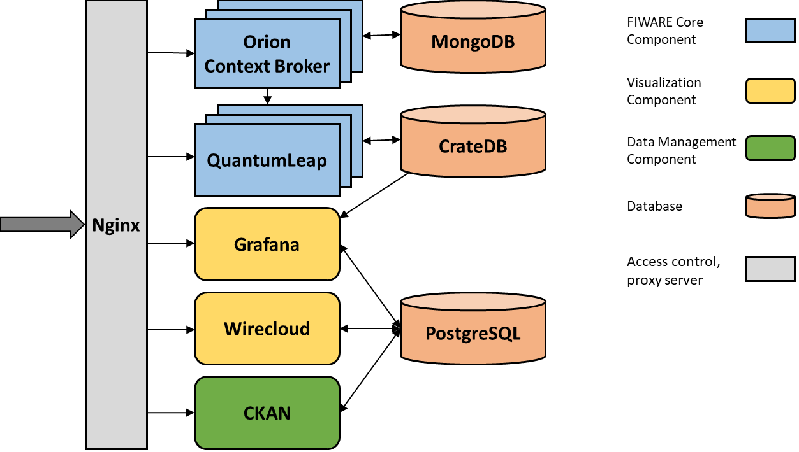

# CityIoT FIWARE platform

The goal of the [CityIoT project](https://www.cityiot.fi/english) is to define a vendor independent IoT platform for SmartCity applications. [FIWARE](https://www.fiware.org) was selected as the technical framework, because it has similar goals towards vendor independence and has already gained interest in the SmartCity community. FIWARE offers open source components for building a platform for smart applications. This repository contains the CityIoT FIWARE platform code that anyone can use to setup their own FIWARE platform. There a few options that can chosen to affect on how the platform is deployed and which components are included in the platform.

A document regarding the CityIoT FIWARE platform and its various technical details: [Report on FIWARE Platform](https://drive.google.com/file/d/1yueGrdArlFmz8ZzchTXWuhbgC9dKUuGN). The installation instructions for the platform can be found in this file.

Table of Contents
- [CityIoT FIWARE platform](#cityiot-fiware-platform)
  - [Platform architecture](#platform-architecture)
  - [Deployment instructions](#deployment-instructions)
    - [System requirements](#system-requirements)
    - [Choosing the deployment options (step 1)](#choosing-the-deployment-options-step-1)
    - [Choosing the database settings (step 2)](#choosing-the-database-settings-step-2)
    - [Choosing the admin usernames and passwords (step 3)](#choosing-the-admin-usernames-and-passwords-step-3)
    - [Setting the Nginx access control permission (step 4)](#setting-the-nginx-access-control-permission-step-4)
    - [Getting the SSL certificate (step 5)](#getting-the-ssl-certificate-step-5)
    - [Installing the platform (step 6)](#installing-the-platform-step-6)
    - [Adding admin user to Wirecloud and CKAN (step 7)](#adding-admin-user-to-wirecloud-and-ckan-step-7)
    - [Uninstalling the platform](#uninstalling-the-platform)
  - [Platform usage instructions](#platform-usage-instructions)
    - [Orion Context Broker](#orion-context-broker)
    - [QuantumLeap](#quantumleap)
    - [IoT Agent for the Ultralight 2.0](#iot-agent-for-the-ultralight-20)
    - [Grafana, Wirecloud, and CKAN](#grafana-wirecloud-and-ckan)
  - [Platform management](#platform-management)
    - [Updating deployment options](#updating-deployment-options)
    - [Updating Nginx access control permissions](#updating-nginx-access-control-permissions)
    - [Updating SSL certificate](#updating-ssl-certificate)
    - [Scaling the components](#scaling-the-components)
    - [Backing and restoring data](#backing-and-restoring-data)
    - [Memory issue with Orion](#memory-issue-with-orion)

## Platform architecture

The FIWARE platform is composed of several FIWARE services with the access control management handled by Nginx server.
All services have been made available using Docker containers.
A single-node Docker swarm is used to make the scaling of some of the services easier.

All the FIWARE services are accessed through Nginx proxy server with each service having its own address path.
The Nginx server handles the communication encryption using TLS as well as load balancing using cache for queries.
A FIWARE service based access control is also handled by the Nginx server.



Available services (only Orion is a mandatory part of a FIWARE platform, all other services are optional but are included by default in the CityIoT FIWARE platform):

- [Orion Context Broker](https://fiware-orion.rtfd.io/) (version 2.3.0)
    - The core FIWARE Generic Enabler that provides [FIWARE NGSIv2 API](http://fiware.github.io/specifications/ngsiv2/stable/).
    - Uses Mongo database to store the data.
    - Uses FIWARE service based access control (provided by the custom Nginx server rules).
    - By default 5 replicas are running at the same time to provide better availability and performance.
- [QuantumLeap](https://quantumleap.rtfd.io/) (version 0.7.5)
    - FIWARE Generic Enabler that supports the storage of FIWARE NGSIv2 data into a time series database, and provides an [API](https://app.swaggerhub.com/apis/smartsdk/ngsi-tsdb/0.7) for accessing the stored data.
    - Normally used to store any changed attribute values according to the subscriptions made to Orion.
    - Uses Crate database to store the data.
    - Uses FIWARE service based access control (provided by the custom Nginx server rules).
    - By default 3 replicas are running at the same time to provide more availability and performance.
- [Grafana](https://grafana.com/) (version 6.5.3)
    - Open source software for time series analytics and visualization.
    - Uses its own user management system that is independent of the access control management provided by Nginx.
    - Can connect directly to the Crate database used by QuantumLeap.
    - Stores user created data (settings, dashboards, etc.) to a PostgreSQL database.
- [Wirecloud](https://wirecloud.rtfd.io/) (version 1.3)
    - FIWARE Generic Enabler that provides a web mashup platform that can be used to develop operational dashboards which are highly customizable by end users.
    - Uses its own user management system that is independent of the access control management provided by Nginx.
    - Stores user created data (settings, dashboards, etc.) to PostgreSQL database.
- [CKAN](https://ckan.org/) (version 2.8) with [FIWARE CKAN extensions](https://fiware-ckan-extensions.rtfd.io/)
    - CKAN is open source data management system that can be used to publish and share data.
    - FIWARE CKAN extensions provide support for publication of datasets matching FIWARE NGSI format.
    - Uses its own user management system that is independent of the access control management provided by Nginx.
    - Stores user created data (settings, dataset information, etc.) to PostgreSQL database.

## Deployment instructions

This section contains instructions on how to setup a new CityIoT FIWARE platform. There are several steps but depending on the deployment options, all of them might not be required .

### System requirements

The platform has been tested on Ubuntu 18.04.3 LTS operating system.

Required software:
- [Bash Shell](https://www.gnu.org/software/bash/) (tested with version 4.4.20)
- [Docker Engine](https://docs.docker.com/engine/install/ubuntu/) (tested with version 19.03.5)
- [Docker Compose](https://docs.docker.com/compose/install/) (tested with version 1.25.1)

At least port 80 needs to be available on the system. Secure connections require also port 443.

### Choosing the deployment options (step 1)

The main deployment options can be found in the file [`main_settings.env`](./main_settings.env). They can be changed manually editing the file with a text editor. The available options:

- `FIWARE_USE_HTTPS`
  - If set to `true`, all network traffic is secured with the HTTPS protocol. Otherwise, unsecure HTTP is used with all network traffic.
- `FIWARE_USE_SUBDOMAINS`
  - If set to `true`, the data usage services Grafana, Wirecloud, and CKAN are all served on their own subdomains, e.g. `https://grafana.<DOMAIN_NAME>`. Otherwise, these services are served on dedicated ports: Grafana on port 3000, Wirecloud on port 8000, and CKAN on port 5000.
- `DOMAIN_NAME`
  - This is the domain name on which the platform will be deployed on. It can be the domain name of the server or an IP address. Even `localhost` or `127.0.0.1` is possible, if the intention is to just test the platform on a local machine. If using an IP address, the HTTPS protocol and the subdomains chosen in the previous options are not available.
- `ORION_VERSION`
  - Setting to choose Orion Context Broker version.
- `ORION_REPLICAS`
  - Setting to choose how many Orion replicas are deployed.
- `FIWARE_INCLUDE_QUANTUMLEAP`
  - Setting to choose whether to include QuantumLeap on the platform. If `true`, QuantumLeap will be included, otherwise not.
- `QL_VERSION`
  - Setting to choose the QuantumLeap version.
- `QL_REPLICAS`
  - Setting to choose how many QuantumLeap replicas are deployed.
- `QL_USE_GEOCODING`
  - Setting to choose whether to use the geocoding feature of QuantumLeap. If `true`, the values for empty location coordinates are determined based on the given street addresses. Otherwise, the feature is not used.
- `FIWARE_INCLUDE_IOTAGENT_UL`
  - Setting to choose whether to include IoT Agent for the Ultralight 2.0 on the platform. If `true`, the IoT Agent will be included, otherwise not.
- `IOTAGENT_UL_VERSION`
  - Setting to choose IoT Agent for the Ultralight 2.0 version.
- `IOTAGENT_UL_REPLICAS`
  - Setting to choose how many IoT Agent for the Ultralight 2.0 replicas are deployed.
- `FIWARE_INCLUDE_GRAFANA`
  - Setting to choose whether to include Grafana on the platform. If `true`, Grafana will be included, otherwise not.
- `FIWARE_INCLUDE_WIRECLOUD`
  - Setting to choose whether to include Wirecloud on the platform. If `true`, Wirecloud will be included, otherwise not.
- `FIWARE_INCLUDE_CKAN`
  - Setting to choose whether to include CKAN on the platform. If `true`, CKAN will be included, otherwise not.

### Choosing the database settings (step 2)

This step involves choosing the main database and the admin user as well as the names of the PostgreSQL databases, usernames for the databases, and the passwords for the users with regards to Grafana, Wirecloud, and CKAN. Thus, this step is not absolutely necessary if none of the three services are included in the platform. This step can also be skipped if the deployer wants to use the default values for the names and passwords (this is NOT recommended practice). Note however, that these usernames and passwords are not the ones used with web applications, those usernames are chosen in the next step (step 3).

The database settings for the main database, Grafana, Wirecloud, and CKAN can be chosen by editing the files `env/secrets/postgres.env`, `env/secrets/grafana.env`, `env/secrets/wirecloud.env`, and `env/secrets/ckan.env`. If these files do not exists yet, they can be created with the default values by running the helper script.

```bash
source create_default_files.sh
```

This script does not change anything about any existing files, and thus it is save to run even after some of the settings have been edited. It is also run during the step 6 to create any missing files if the deployer has skipped any of the previous steps.

The options in `env/secrets/postgres.env`:

- `POSTGRES_DB`
  - The main database name for the PostgreSQL.
- `POSTGRES_USER`
  - The admin username for the PostgreSQL.
- `POSTGRES_PASSWORD`
  - The password for the admin user for the PostgreSQL.

The options in `env/secrets/grafana.env`:

- `GF_DATABASE_NAME`
  - The PostgreSQL database name for Grafana.
- `GF_DATABASE_USER`
  - The PostgreSQL database username for Grafana.
- `GF_DATABASE_PASSWORD`
  - The password for the Grafana user for the PostgreSQL database.

The options in `env/secrets/wirecloud.env`:

- `DB_NAME`
  - The PostgreSQL database name for Wirecloud.
- `DB_USERNAME`
  - The PostgreSQL database username for Wirecloud.
- `DB_PASSWORD`
  - The password for the Wirecloud user for the PostgreSQL database.

The options in `env/secrets/ckan.env`:

- `CKAN_POSTGRES_DB`
  - The PostgreSQL database name for CKAN.
- `CKAN_POSTGRES_USER`
  - The PostgreSQL database username for CKAN.
- `CKAN_POSTGRES_PASSWORD`
  - The password for the CKAN user for the PostgreSQL database.
- `DATASTORE_POSTGRES_DB`
  - The PostgreSQL database name for read-only database for CKAN.
- `DATASTORE_POSTGRES_USER`
  - The PostgreSQL database username for read-only database for CKAN.
- `DATASTORE_POSTGRES_PASSWORD`
  - The password for the read-only CKAN user for corresponding the PostgreSQL database.

### Choosing the admin usernames and passwords (step 3)

This step involves choosing the admin usernames for Grafana, Wirecloud, and CKAN. The actual admin accounts are created for Grafana during step 6 and for Wirecloud and CKAN during step 7. These admin accounts can be used to access the applications and to create any additional user accounts that are needed for the applications.

For Grafana and CKAN also the passwords for the admin users are chosen here. For Wirecloud the password is chosen interactively when the admin account is created in step 7. This step can be skipped if the deployer wants to use the default values for the usernames and passwords (this is definitely NOT recommended in any production environment).

These settings are found in the file `secrets/admins.env`. If this file does not exist yet, it can be created with the default values by running the helper script.

```bash
source create_default_files.sh
```

The options in `secrets/admins.env`:

- `GRAFANA_ADMIN_USER`
  - The username for the admin user for Grafana.
- `GRAFANA_ADMIN_PASSWORD`
  - The password for the admin user for Grafana.
- `WIRECLOUD_ADMIN_USER`
  - The username for the admin user for Wirecloud.
- `CKAN_ADMIN_USER`
  - The username for the admin user for CKAN.
- `CKAN_ADMIN_PASSWORD`
  - The password for the admin user for CKAN.

### Setting the Nginx access control permission (step 4)

The access control for the FIWARE core components, Orion and QuantumLeap as well as the IoT Agent for Ultralight, is handled by the Nginx server. More information on how the access control system works can be found from the [platform document](https://drive.google.com/file/d/1yueGrdArlFmz8ZzchTXWuhbgC9dKUuGN) on chapter 3.3. The permissions for the users of the platform are modified by editing three Nginx configuration files: `secrets/users.conf`, `secrets/services.conf`, and `secrets/proxy_keys.conf`. Any modified access permission will come to effect when the Nginx server is next restarted. On the first install of the platform this happens as the last part of the step 6. Section [Updating Nginx access control permissions](#updating-nginx-access-control-permissions) contains information on how to update the access control rules when the platform is already running. If the configuration files do not exists yet, they can be created with empty permission by running the helper script.

```bash
source create_default_files.sh
```

Users and their tokens are modified by modifying the file `secrets/users.conf`. The template file [`users_template.conf`](secrets/users_template.conf) contains examples on the format of the file. The lines

```bash
    # example users
    'abcdef'         data-provider;
    '123456'         data-viewer;
```

create two users: user called `data-provider`, whose token is `abcdef`, and user `data-viewer`, whose token is `123456`. Note the semicolon at the end of each line. Do not edit the default or intruder users. The tokens are used by providing them as the value of the HTTP header `apikey`. See section [Orion usage examples](#orion-context-broker) for examples of using the tokens.

The permissions for each users are given in the file `secrets/services.conf`. The template file [`services_template.conf`](secrets/services_template.conf) contain examples on the format of the file. The lines

```bash
    # give the data-provider write-access to the service "example"
    data-provider:example         write-access;

    # give the data-provider read-access to all services
    '~^data-provider:(.)*'        read-access;

    # give the data-viewer read access to the service "example"
    data-viewer:example           read-access;
```

gives the user `data-provider` both read and write access to the FIWARE service `example` and read access (GET queries) to all FIWARE services. The user `data-viewer` is only given read access to the FIWARE service `example` and no access to any other FIWARE service. Note the colons between the users and services as well as the semicolons at the end of each line. The second rule gives an example on how to regex with the service names. The access control rules are handled by Nginx line by line in order and the first matching rule is the one that is used.

The file `secrets/proxy_keys.conf` is used to setup the external token modification for the `/notify` endpoint. If no external data sources or this endpoint are in use this last part of step 4 can be skipped.

The external tokens can be used to increase the platform security when using external data sources for the Orion Context Broker by avoiding putting actual CityIoT platform tokens on any external data source. The external tokens are used by the HTTP header `platform-apikey` and they are HTTP request method dependent. The template file [`secrets/proxy_keys_template.conf`](secrets/proxy_keys_template.conf) contains an example on the format of the file. The line

```bash
    'POST:external_token'   'apikey_token';
```

means that, when the `/notify` endpoint is used with a POST request and the value `external_token` for the HTTP header `platform-apikey`, the request is forwarded to the Orion Context Broker (to the endpoint `/v2/op/notify`) with `apikey_token` as the value of the HTTP header `apikey`.

### Getting the SSL certificate (step 5)

### Installing the platform (step 6)

```bash
./start_fiware.sh
```

### Adding admin user to Wirecloud and CKAN (step 7)

```bash
./create_fiware_admin.sh
./create_ckan_admin.sh
```

### Uninstalling the platform

```bash
./stop_fiware.sh
```

## Platform usage instructions

### Orion Context Broker

### QuantumLeap

### IoT Agent for the Ultralight 2.0

### Grafana, Wirecloud, and CKAN

## Platform management

### Updating deployment options

### Updating Nginx access control permissions

### Updating SSL certificate

### Scaling the components

### Backing and restoring data

### Memory issue with Orion
